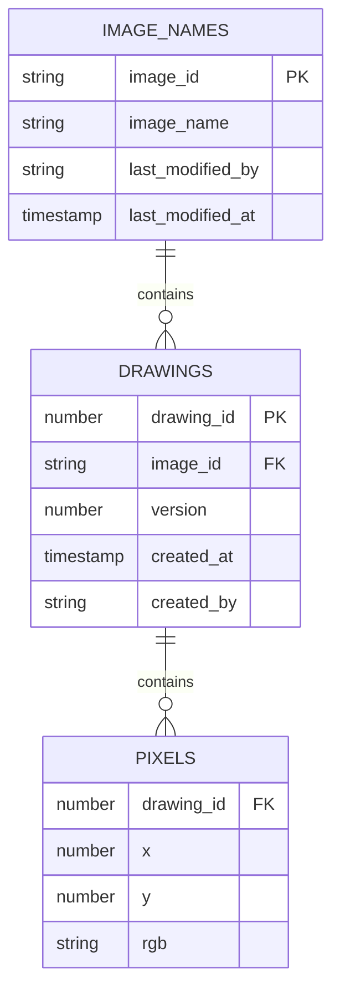

# PixelNote

PixelNote は、200x200 ピクセルのキャンバスに絵を描いて保存・共有できる Web アプリです。

## 主な機能

- 200x200 のキャンバスに描画
- 筆のサイズ：細い・普通・太い（.envで定義）
- ズーム倍率：最小〜最大倍率（.envで定義）
- 全ユーザーが画像を閲覧・編集可能
- バージョンごとの履歴保存（上限なし）
- 一覧表示は `画像名`, `最終更新者`, `最終更新日時`、フィルタ・ソート可能
- OpenID Connect（Google）で認証
- 保存形式は XY 座標 + RGB 色コード（画像形式で保存しない）

## ER図（Mermaid）



## Apple Silicon / Intel 切り替えビルド

```bash
docker buildx create --use
docker-compose -f docker-compose.multiarch.yml build
```
