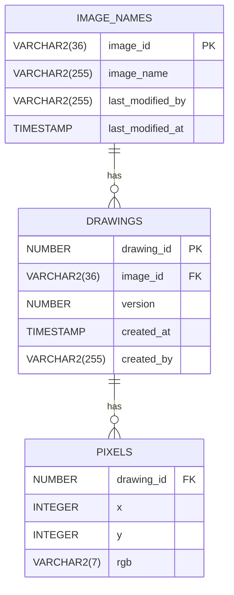

# PixelNote

PixelNoteは200x200ピクセルのキャンバスにブラウザから絵を描き、バージョン管理・共有ができるWebアプリです。

---

## 概要

- **フロントエンド**：React
- **バックエンド**：FastAPI
- **データベース**：SQLite/Oracle（切替可能、ピクセル情報はX,Y,rgbで保存）
- **認証**：Google OpenID Connect
- **CI/CD**：Docker + GitHub Actions（自動テスト、Apple Silicon・Intel対応）

---

## 主な機能・要件

- 200x200キャンバス、ズーム・ブラシサイズ選択可能（`.env`で設定）
- 画像保存時は必ず「image_name」を入力（初回のみ）
- 画像一覧は「最終更新者」「ファイル名」「最終更新日時」で降順表示（フィルタ・ソート可）
- 画像名はいつでも変更可能。保存毎にバージョン管理
- 各画像に所有者概念はナシ、誰でも編集可能
- ピクセル情報は `(x, y, rgb)` 形式で `pixels` テーブルに保存
- 自動保存・アーカイブなし、バージョン上限なし
- エラーコードは拡張性重視で外部ファイル化
- API単位でcommit/rollback、DML/SELECTは分離

---

## テーブル構成（Oracle準拠）



---

## API例

- POST /api/create : 新規画像作成
- POST /api/save/{image_id} : 既存画像のバージョン追加
- POST /api/rename : 画像名の変更
- GET /api/list : 画像一覧（降順）
- GET /api/images/{image_id}/versions : バージョン一覧（降順）
- GET /api/images/{image_id}/version/{version} : バージョンデータ取得

---

## 開発とテスト

- DBはSQLite/Oracleを.envで切替
- Docker対応（Apple Silicon/Intel両対応ビルド）
- GitHub ActionsによるCI自動テスト（両DBで検証）
- テスト/本番/開発で同じDockerイメージ・同一コードで運用
- 開発時はDockerコンテナ内にファイルコピーして即反映（マウント競合は避ける）
- 拡張性重視（カラム追加やバリデーション、API拡張も容易に）
- エラーハンドリング・バリデーションはFastAPIの標準例外で統一
- DB初期化・サンプルデータ登録


---

## 実装スタイル

- 全設定は .env で集中管理（DB接続、ブラシサイズ、ズーム倍率等も環境変数管理）
- DB操作の分離
  - INSERT/UPDATE/SELECT関数はcommit/rollbackしない
  - API本体関数（create_image等）がcommit/rollbackを担う
  - SELECTも個別関数化し、API本体から呼ぶ
  - 初期化（テーブル作成）はinit_sqlite.py / init_oracle.pyで明示的に実行
- 降順ソート
  - /api/list … last_modified_at DESC
  - バージョン一覧 … created_at DESC
- エラーコードは拡張性のため外部管理
- 全APIはテストケースで検証
- routes.py
  - try-exceptやraise不要
  - RequestValidationErrorをcatchしないよう徹底
  - Dict変換はここでのみ明示的に行うことで責任範囲が明確にする
- DB層
  - 必要に応じてRequestValidationErrorでraise
  - 「タプルやrowのリスト」を返すだけ
  - APIから呼ばれる単位でcommit
  - Exception, RequestValidationErrorでrollback
  - 初期化ロジック（テーブル作成など）は init_sqlite.py や init_oracle.py など「init専用スクリプト」に集約する
  - sqlite_impl.py などDB操作用クラスは、通常時は「既存テーブルを操作するだけ」
- main.pyで全て一元エラーハンドリング
- 明示的な整形・責任分離を徹底
- models.py
  - 内部ロジックやDB整形を行い型安全＆再利用
  - ドメインオブジェクト、DBデータの1行＝エンティティ（内部用／業務ロジック用）。
  - 対応するテーブルの列を全て含む
- schemas.py
  - FastAPI/Pydantic用（APIリクエスト・レスポンスの検証・シリアライズ用）
  - API I/Oの型検証・エラーメッセージを集中管理
- CIやstartup.sh、開発初期のみ明示的にpython app/db/init_sqlite.pyを実行して初期化
- Docker起動用スクリプト
  - CONTAINER_NAME を一意に固定（pixelnote-dev）
  - 停止中・稼働中コンテナがあれば停止・削除（安心して何度でも再起動可能）
  - app/・startup.sh・.env・DB初期化スクリプトなどをマウント
  - ローカルの8000ポートにバインド
  - --env-file .env で環境変数も自動適用
  - docker image名は pixelnote:latest（必要に応じてビルド）
  - バックグラウンドで動作

---

## テスト・CI

- SQLite/Oracle両DBでpytest自動テスト
  - DockerでDB起動（Oracleはgvenzl/oracle-xeイメージ）
  - GitHub Actionsで両DB対象に全テスト
- 主なテスト
  - CRUD正常系、異常系
  - 複数画像・複数バージョン
  - 並び順（降順）が正しいか
  - DBエラー時ロールバックされるか

## データベース初期化

PixelNoteは **SQLite** と **Oracle** 両対応です。  
初回セットアップ時や、テーブルを作り直したい場合は下記スクリプトを実行してください。

### SQLiteの場合

```bash
python app/db/init_sqlite.py
```

- SQLITE_DB_PATH 環境変数でDBファイル名を指定できます（デフォルトは pixelnote.sqlite3）。

### Oracleの場合

```bash
export DB_USER=xxxx
export DB_PASSWORD=xxxx
export DB_DSN=//host:port/SERVICE
python app/db/init_oracle.py
```

- テーブルが存在しない場合のみ作成されます。
- Oracleへの接続情報は必ず環境変数で指定してください。

# 開発コンテナ起動例

- run-dev.shを使うことで常にクリーンな環境を維持
- ./run-dev.sh
- docker logs -f pixelnote-dev
- マウント競合対策として「ファイルは起動時にコンテナへコピー」方式推奨
## ライセンス

MIT License  
Copyright (c) 2025 PixelNote