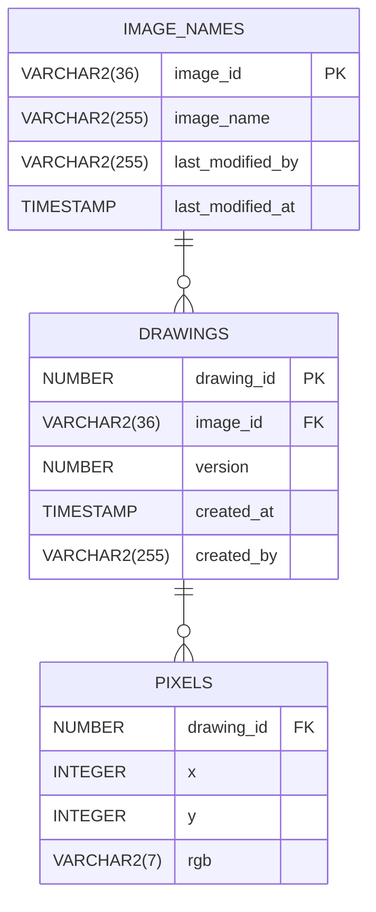

# PixelNote

PixelNoteは200x200ピクセルのキャンバスに描画し、バージョン管理・共有ができるWebアプリです。

---

## 概要

- **フロントエンド**：React
- **バックエンド**：FastAPI
- **データベース**：SQLite/Oracle（切替可能、ピクセル情報はX,Y,rgbで保存）
- **認証**：Google OpenID Connect
- **CI/CD**：Docker + GitHub Actions（自動テスト、Apple Silicon・Intel対応）

---

## 主な機能・要件

- 200x200キャンバス、ズーム・ブラシサイズ選択可能（`.env`で設定）
- 画像保存時は必ず「image_name」を入力（初回のみ）
- 画像一覧は「最終更新者」「ファイル名」「最終更新日時」で降順表示（フィルタ・ソート可）
- 画像名はいつでも変更可能。保存毎にバージョン管理
- 各画像に所有者概念はナシ、誰でも編集可能
- ピクセル情報は `(x, y, rgb)` 形式で `pixels` テーブルに保存
- 自動保存・アーカイブなし、バージョン上限なし
- エラーコードは拡張性重視で外部ファイル化
- API単位でcommit/rollback、DML/SELECTは分離

---

## テーブル構成（Oracle準拠）

---

## API例

- POST /api/create : 新規画像作成
- POST /api/save/{image_id} : 既存画像のバージョン追加
- POST /api/rename : 画像名の変更
- GET /api/list : 画像一覧（降順）
- GET /api/images/{image_id}/versions : バージョン一覧（降順）
- GET /api/images/{image_id}/version/{version} : バージョンデータ取得

---

## 開発とテスト

- DBはSQLite/Oracleを.envで切替
- Docker対応（Apple Silicon/Intel両対応ビルド）
- GitHub ActionsによるCI自動テスト（両DBで検証）

---

## 実装スタイル

- DB操作の分離
  - INSERT/UPDATE/SELECT関数はcommit/rollbackしない
  - API本体関数（create_image等）がcommit/rollbackを担う
  - SELECTも個別関数化し、API本体から呼ぶ
- 降順ソート
  - /api/list … last_modified_at DESC
  - バージョン一覧 … created_at DESC
- エラーコードは拡張性のため外部管理
- 全APIはテストケースで検証
- APIから呼ばれる単位でcommit
- Exception, RequestValidationErrorでrollback
- routes.py ではRequestValidationErrorをcatchしないよう徹底
- DB層は必要に応じてRequestValidationErrorでraise
- main.pyで全て一元ハンドリング

---

## テスト・CI

- SQLite/Oracle両DBでpytest自動テスト
  - DockerでDB起動（Oracleはgvenzl/oracle-xeイメージ）
  - GitHub Actionsで両DB対象に全テスト
- 主なテスト
  - CRUD正常系、異常系
  - 複数画像・複数バージョン
  - 並び順（降順）が正しいか
  - DBエラー時ロールバックされるか

## ライセンス

MIT License  
Copyright (c) 2025 PixelNote